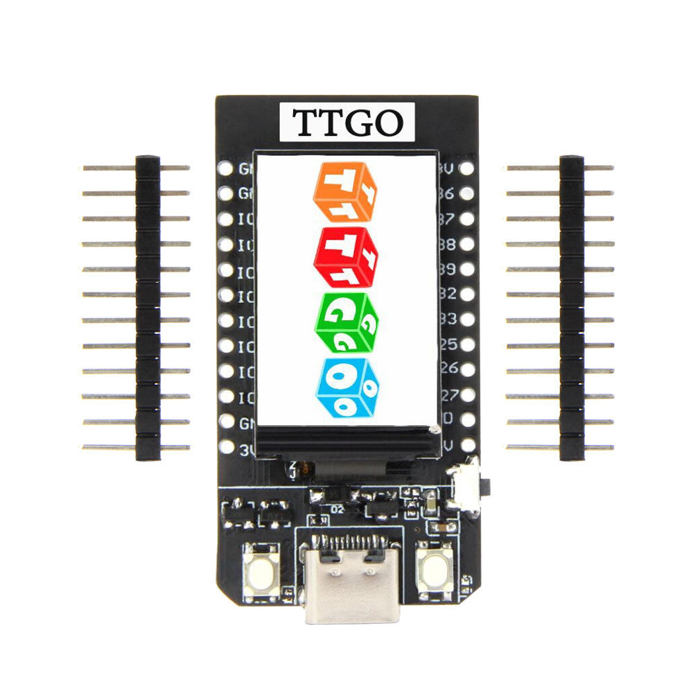
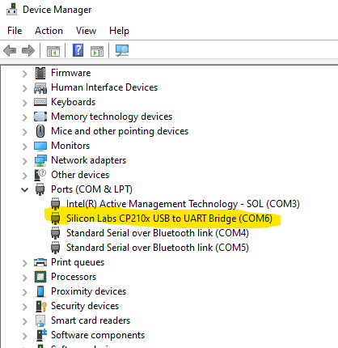

## Preparations

Preparations for a workshop using micropython on a ttgo ESP32 with integrated 240 x 135 pixel lcd color display

What you need is:
 - pc/laptop
 - usb-c cable
 - ESP32 dev board



The goal of these preparations is to establish connectivity between the board and your computer.

 - Install drivers for the USB to UART Bridge
   Find them here: https://www.silabs.com/developers/usb-to-uart-bridge-vcp-drivers
   This one for windows: https://www.silabs.com/documents/public/software/CP210x_Universal_Windows_Driver.zip

 - Install required tools, which are python based. You can use any 3.7+ environment on your computer. Just be sure that ist has access to your local serial ports. (`COM1`,  `COM2` etc on windows or `/dev/ttyUSB` etc on unix like). **This excludes WSL2**, so if on windows use a python version installed under windows.

    ```
    pip install esptool, rshell, adafruit-ampy
    ```

 - Connect the board with a usb-c cable. It should show up as a usb-to-serial device somewhere. In windows,   check the device manager. 

    
 
   In Unix like, find it with  `ls /dev/tty*USB*`


 - Communicate with the chip:
   ```sh
   esptool --chip esp32 chip_id
   ```

   If the output looks something like below, you are all set:  
    
   ``` sh
   esptool.py v3.0
   Found 4 serial ports
   Serial port COM6
   Connecting........_
   Chip is ESP32-D0WDQ6 (revision 1)
   Features: WiFi, BT, Dual Core, 240MHz, VRef calibration in efuse, Coding Scheme None
   Crystal is 40MHz
   MAC: 24:62:ab:f1:bb:c8
   Uploading stub...
   Running stub...
   Stub running...
   Warning: ESP32 has no Chip ID. Reading MAC instead.
   MAC: 24:62:ab:f1:bb:c8
   Hard resetting via RTS pin...
   ```

   Remember the serial port the device is connected on, this will be useful later